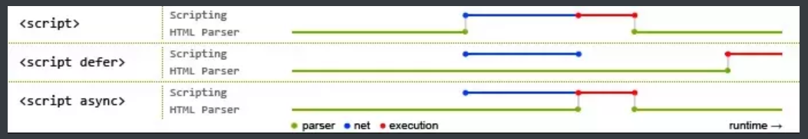

# HTML

[[TOC]]

## defer async

`<script>`标签属性：
| attr | desc |
| ---- | ---- |
| 空 | 同步下载，立即执行 |
| defer | 异步下载，延后执行 |
| async | 异步下载，立即执行 |

## tags

[input](https://developer.mozilla.org/zh-CN/docs/Web/HTML/Element/Input)
input type

checkbox: 复选框。使用`value`属性定义此控件提交时的值。`checked`属性批示控件是不被选择。也可以使用`indeterminate`批示复复选框在一种不确定的状态（大多数平台上显示为一条穿过复选框的水平线）。

<input type="checkbox" indeterminate>并没有横线效果= =!
