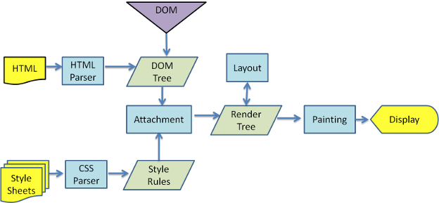

# 浏览器

[[TOC]]

## 从输入URL到展示的过程

- DNS 解析
- TCP 三次握手
- 发送请求，分析 url，设置请求报文(头，主体)
- 服务器返回请求的文件 (html)
- 浏览器渲染
  - HTML parser --> DOM Tree
    - 标记化算法，进行元素状态的标记
    - dom 树构建
  - CSS parser --> Style Tree
    - 解析 css 代码，生成样式树
  - attachment --> Render Tree
    - 结合 dom树 与 style树，生成渲染树
  - layout: 布局
  - GPU painting: 像素绘制页面



## 重绘与回流

当元素的样式发生变化时，浏览器需要触发更新，重新绘制元素。这个过程中，有两种类型的操作，即重绘与回流。

- **重绘(repaint)**: 当元素样式的改变不影响布局时，浏览器将使用重绘对元素进行更新，此时由于只需要UI层面的重新像素绘制，因此 **损耗较少**
- **回流(reflow)**: 当元素的尺寸、结构或触发某些属性时，浏览器会重新渲染页面，称为回流。此时，浏览器需要重新经过计算，计算后还需要重新页面布局，因此是较重的操作。会触发回流的操作:
  - 页面初次渲染
  - 浏览器窗口大小改变
  - 元素尺寸、位置、内容发生改变
  - 元素字体大小变化
  - 添加或者删除可见的 dom 元素
  - 激活 CSS 伪类（例如：:hover）
  - 查询某些属性或调用某些方法
    - clientWidth、clientHeight、clientTop、clientLeft
    - offsetWidth、offsetHeight、offsetTop、offsetLeft
    - scrollWidth、scrollHeight、scrollTop、scrollLeft
    - getComputedStyle()
    - getBoundingClientRect()
    - scrollTo()

**回流必定触发重绘，重绘不一定触发回流。重绘的开销较小，回流的代价较高。**

#### 最佳实践:

- css
  - 避免使用`table`布局
  - 将动画效果应用到`position`属性为`absolute`或`fixed`的元素上
- javascript
  - 避免频繁操作样式，可汇总后统一 **一次修改**
  - 尽量使用`class`进行样式修改
  - 减少`dom`的增删次数，可使用 **字符串** 或者 `documentFragment` 一次性插入
  - 极限优化时，修改样式可将其`display: none`后修改
  - 避免多次触发上面提到的那些会触发回流的方法，可以的话尽量用 **变量存住**
  - dom.focus()触发动画执行

## Web Worker

现代浏览器为`JavaScript`创造的 **多线程环境**。可以新建并将部分任务分配到`worker`线程并行运行，两个线程可 **独立运行，互不干扰**，可通过自带的 **消息机制** 相互通信。

**基本用法:**

```js
// 创建 worker
const worker = new Worker('work.js');

// 向主进程推送消息
worker.postMessage('Hello World');

// 监听主进程来的消息
worker.onmessage = function (event) {
  console.log('Received message ' + event.data);
}
```

**限制:**

- 同源限制
- 无法使用 `document` / `window` / `alert` / `confirm`
- 无法加载本地资源

## V8垃圾回收机制

垃圾回收: 将内存中不再使用的数据进行清理，释放出内存空间。V8 将内存分成 **新生代空间** 和 **老生代空间**。

- 新生代空间：用于存活较短的对象

  - 又分成两个空间: from 空间 与 to 空间
  - Scavenge GC算法: 当 from 空间被占满时，启动 GC 算法
    - 存活的对象从 from space 转移到 to space
    - 清空 from space
    - from space 与 to space 互换
    - 完成一次新生代GC

- 老生代空间：用于存活时间较长的对象

  - 从 新生代空间 转移到 老生代空间 的条件

    - 经历过一次以上 Scavenge GC 的对象
    - 当 to space 体积超过25%

  - 标记清除算法

    : 标记存活的对象，未被标记的则被释放

    - 增量标记: 小模块标记，在代码执行间隙执，GC 会影响性能
    - 并发标记(最新技术): 不阻塞 js 执行

  - **压缩算法**: 将内存中清除后导致的碎片化对象往内存堆的一端移动，解决 **内存的碎片化**

## 内存泄露

- 意外的**全局变量**: 无法被回收
- **定时器**: 未被正确关闭，导致所引用的外部变量无法被释放
- **事件监听**: 没有正确销毁 (低版本浏览器可能出现)
- **闭包**: 会导致父级中的变量无法被释放
- **dom 引用**: dom 元素被删除时，内存中的引用未被正确清空

可用 chrome 中的 timeline 进行内存标记，可视化查看内存的变化情况，找出异常点。

## webview debug

推荐工具：

- spy-debugger

