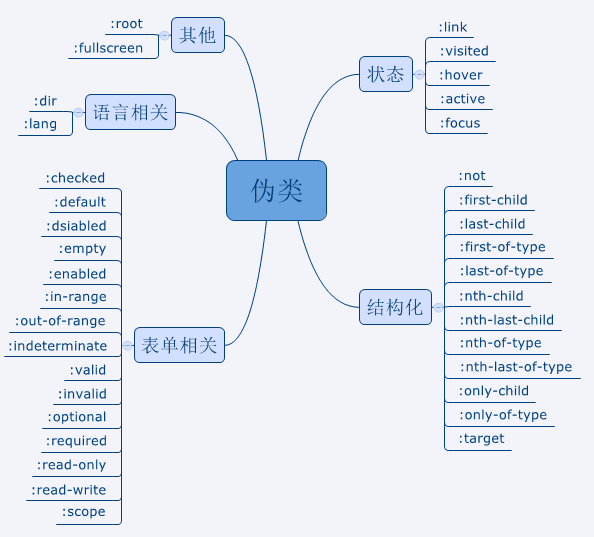

# CSS

[[TOC]]

## 属性

### display

| | block | inline | inline-block | inline-flex |
| ---- | ---- | ---- | ---- | ---- |
| width | Y | N | Y | Y |
| height | Y | N | Y | Y |
| margin-top, margin-bottom | Y | N | Y | Y |
| margin-left, margin-right | Y | Y | Y | Y |
| padding-top, padding-bottom | Y | Y | Y | Y |
| padding-left, padding-right | Y | Y | Y | Y |

* block独占一行，inline-block不换行
* inline: width, height, 竖直方向margin不起作用
* inline-(flex|block) 内部表现为flex|block

### position

1. absolute：绝对定位，是相对于最近的且不是static定位的父元素来定位。
2. fixed：绝对定位，是相对于浏览器窗口来定位的，是固定的，不会跟屏幕一起滚动。
3. relative：相对定位，是相对于其原本的位置来定位的。
4. sticky: 粘性定位，注意：父级元素不能有任何`overflow:visible`以外的overflow设置，否则没有粘滞效果。参考：[杀了个回马枪，还是说说position:sticky吧-张鑫旭](https://www.zhangxinxu.com/wordpress/2018/12/css-position-sticky/)
5. static：默认值，没有定位。
6. inherit：继承父元素的position值。

### vertical-align

注意 `vertical-align` 只对行内元素、表格单元格元素生效：不能用它垂直对齐[块级元素](https://developer.mozilla.org/zh-CN/docs/Web/HTML/Block-level_elements)。

块、行内块元素内子元素垂直对齐方法：设置父元素`height`、`line-height`属性。

默认值：`baseline`

参考：[What is Vertical Align?](https://css-tricks.com/what-is-vertical-align/)

## CSS选择器及其优先级

* !important
* 内联选择器1000
* ID选择器0100
* 类/属性/伪类选择器0010
* 元素/伪元素/关系选择器0001
* 通配符选择器0000

## 伪类与伪元素

伪类存在的意义是为了通过选择器找到那些不存在DOM树中的信息以及不能被常规CSS选择器获取到的信息。

1. 获取不存在与DOM树中的信息。比如a标签的:link、visited等，这些信息不存在与DOM树结构中，只能通过CSS选择器来获取；
2. 获取不能被常规CSS选择器获取的信息。比如：要获取第一个子元素，我们无法用常规的CSS选择器获取，但可以通过 :first-child 来获取到。



### 伪元素

伪元素用于创建一些不在文档树中的元素，并为其添加样式。比如说，我们可以通过:before来在一个元素前增加一些文本，并为这些文本添加样式。虽然用户可以看到这些文本，但是这些文本实际上不在文档树中。常见的伪元素有：`::before`，`::after`，`::first-line`，`::first-letter`，`::selection`、`::placeholder`等

> 因此，伪类与伪元素的区别在于：有没有创建一个文档树之外的元素。

### ::after和:after的区别

在实际的开发工作中，我们会看到有人把伪元素写成`:after`，这实际是 CSS2 与 CSS3新旧标准的规定不同而导致的。

CSS2 中的伪元素使用1个冒号，在 CSS3 中，为了区分伪类和伪元素，规定伪元素使用2个冒号。所以，对于 CSS2 标准的老伪元素，比如`:first-line`，`:first-letter`，`:before`，`:after`，写一个冒号浏览器也能识别，但对于 CSS3 标准的新伪元素，比如::selection，就必须写2个冒号了。

## BFC

BFC全称块级格式化上下文(Block Formatting Context)。它决定了元素如何对其内容进行定位及与其他元素的关系和相互作用。BFC提供了一个环境，元素在这个环境中按照一定规则布局。可以说BFC是一个作用范围，可以理解为一个独立的容器，

当一个元素浮动之后，它会被移出正常的文档流，然后向左或者向右平移，一直平移直到碰到了所处的容器的边框，或者碰到另外一个浮动的元素。

总结下：

 - 大拇指：body爸爸元素哈哈哈哈哈哈哈哈
 - 食指：float除none以外的浮动元素
 - 中指：position绝对定位元素包括absolute fixed
 - 无名指：overflow除visible以外的值 hidden auto scroll
 - 小指：display: flex inline-block table-cells

**BFC的应用：**

1. 清除浮动
2. 布局
3. 解决块级盒边距重叠


## 像素

> [CSS像素、物理像素、逻辑像素、设备像素比、PPI、Viewport](https://github.com/jawil/blog/issues/21)

## 移动端1px

一般来说，在PC端浏览器中，设备像素比（dpr）等于1，1个css像素就代表1个物理像素；但是在retina屏幕中，dpr普遍是2或3，1个css像素不再等于1个物理像素，因此比实际设计稿看起来粗不少。

1. 伪元素+scale

```css
.box:after {
  content: '';
  position: absolute;
  bottom: 0;
  width: 100%;
  height: 1px;
  transform: scale(0.5);
  transform-origin: 0 0;
  background: #000;
}
```

2. border-image

```css
div {
  border-width: 1px 0px;
  -webkit-border-image: url(border.png) 2 0 stretch;
  border-image: url(border.png) 2 0 stretch;
}
```

## rem方案

viewport = 可视区域，可能比浏览器/webview的可视区域要大
移动端 默认viewport = 980/1024px
width=device-width

retina屏，分辨率提高，尺寸不变
css 1px = 2px 物理，放大缩小也有影响
window.devicePixelRatio = 物理像素 / 独立像素

可视区域
document.documentElement.clientWidth
window.innerWidth

```js
! function() {
    function Rem() {}
    Rem.prototype.reset = function() {
        var html = document.documentElement;
        // 750设计稿，base=100
        var base = Math.min(html.clientWidth, 750) / 750 * 100;
        // 设置html基础字体大小100px
        html.style.fontSize = base + "px";


        // 设置后实际大小，因为可能不是100
        var scale = parseFloat(window.getComputedStyle(html).fontSize);
        // 目标和实际比
        var rate = base / scale;
        // 如果比值不为1，即实际有偏差，将目标乘以比率
        1 !== rate && (html.style.fontSize = base * rate + "px");
    };

    window.Adapter = new Rem();
    window.Adapter.reset();
    window.onload = function() {
        window.Adapter.reset();
    };
    window.onresize = function() {
        window.Adapter.reset();
    };
}();
```

```less
@one = 100rem; // 1rem = 100px
width: 24/@one; // (24/100)rem = 0.24*100px
```

### 超出文本省略号

一、div内显示一行，超出部分用省略号显示

```css
  white-space: nowrap;
  overflow: hidden;
  text-overflow: ellipsis;
```

二、div内显示两行或三行，超出部分用省略号显示

```css
  overflow: hidden;
  text-overflow: ellipsis;
  display: -webkit-box;
  -webkit-line-clamp: 2;（行数，头条面试：该属性写1，能不能显示一行？可以）
  -webkit-box-orient: vertical;
```

## 两边宽度固定中间自适应的三栏布局

### flex

```html
<style>
    body {
        min-width: 500px;
    }
    .container {
        display: flex;
        flex-direction: row;
        height: 100%;
    }
    .center {
        flex: 1;
        background: lightgreen;
    }
    .left {
        width: 200px;
        background: lightblue;
    }
    .right {
        width: 150px;
        background: pink;
    }
</style>
<div class="container">
    <div class="left"></div>
    <div class="center"></div>
    <div class="right"></div>
</div>
```

### 圣杯布局

```html
<style>
body{
    min-width: 550px;
}
#container{
    padding-left: 200px;
    padding-right: 150px;
}
#container .column{
    float: left;
}
#center{
    width: 100%;
}
#left{
    width: 200px;
    margin-left: -100%;
    position: relative;
    right: 200px;
}
#right{
    width: 150px;
    margin-right: -150px;
}
</style>
<div id="container">
    <div id="center" class="column">center</div>
    <div id="left" class="column">left</div>
    <div id="right" class="column">right</div>
</div>
```

### 双飞翼布局

```html
<style>
body {
    min-width: 500px;
}
#container {
    width: 100%;
}
.column {
    float: left;
}
#center {
    margin-left: 200px;
    margin-right: 150px;
}
#left {
    width: 200px;
    margin-left: -100%;
}
#right {
    width: 150px;
    margin-left: -150px;
}
</style>
<div id="container" class="column">
    <div id="center">center</div>
</div>
<div id="left" class="column">left</div>
<div id="right" class="column">right</div>

```

## 小技巧

1. 移动端必须指定默认值（默认大约1.2）
2. 推荐使用无单位数值 [](https://codepen.io/itibbers/pen/pXMgpO)
3. 无障碍：主段落内容至少为1.5
4. 简写font: size/line-height family;
5. 等比矩形可用 :after + padding 实现
6. outline属性不占空间
7. button:disabled { cursor: not-allowed; }
8. CSS3：width: fill-available; fit-content; max-content; min-content;
9. --percent: 50; background-size: calc(var(--percent) * 1%);

