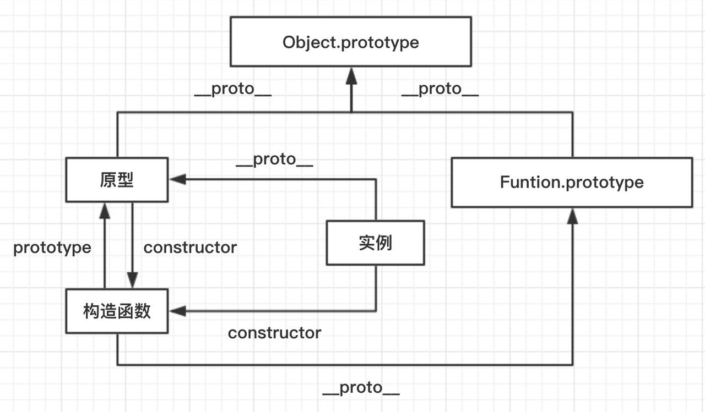
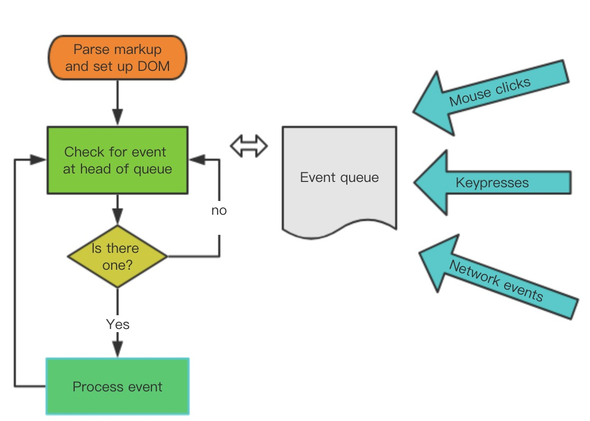

# JS

[[TOC]]

## 数据类型

6种简单（基本）数据类型: Undefined, Null, Boolean, Number, String, Symbol

1种复杂（引用）数据类型: Object

typeof variable => undefined / object / boolean / number / string / function

> 从技术角度讲，函数在ECMAScript中是对象，不是一种数据类型。然而，函数也确实有一些特殊的属性，因此通过typeof操作符来区分函数和其他对象是有必要的。


## 原型、构造函数、实例、原型链



可能通过 `new` 新建一个实例对象的函数叫构造函数，构造函数的 `prototype` 即原型。每个 Javascript 对象都包含一个`__proto__`属性，指向它的构造函数的原型，通过 `constructor` 属性指向构造函数。

原型链由原型对象组成，每个对象都有 `__proto__` 属性，指向了创建该对象的构造函数的原型，`__proto__` 将对象连接起来组成了原型链。可以通过这个对象链实现继承和共享属性。

## 继承

- 最优化: **圣杯模式**

```js
var inherit = (function(c,p){
	var F = function(){};
	return function(c,p){
		F.prototype = p.prototype;
		c.prototype = new F();
		c.uber = p.prototype;
		c.prototype.constructor = c;
	}
})();
```

- 使用 ES6 的语法糖 `class / extends`

⚠️待补充class语法糖原理

## 闭包

闭包属于一种特殊的作用域，称为 静态作用域。它的定义可以理解为：父函数被销毁的情况下，返回出的子函数的作用域链`[[scope]]`还保存着父函数的变量对象和作用域链，因此可以访问到父级的变量对象，这样的函数称为闭包。

闭包会产生一个很经典的问题:

- 多个子函数的`[[scope]]`都是同时指向父级，是完全共享的。因此当父级的变量对象被修改时，所有子函数都受到影响。

解决:

- 变量可以通过 **函数参数的形式** 传入，避免使用默认的`[[scope]]`向上查找
- 使用`setTimeout`包裹，通过第三个参数传入
- 使用 **块级作用域**，让变量成为自己上下文的属性，避免共享

## new执行过程

- 新生成一个对象
- 链接到原型: `obj.__proto__ = Con.prototype`
- 绑定this: `apply`
- 返回新对象(如果构造函数有自己 retrun 时，则返回该值)

## 对象拷贝

浅拷贝: 以赋值的形式拷贝引用对象，仍指向同一个地址，**修改时原对象也会受到影响**

- `Object.assign`
- 展开运算符(...)

深拷贝: 完全拷贝一个新对象，**修改时原对象不再受到任何影响**

- `JSON.parse(JSON.stringify(obj))`
  - 性能最快
  - 具有循环引用的对象时，报错
  - 当值为函数、`undefined`、或`symbol`时，无法拷贝
- 递归进行逐一赋值

```js
function deepClone(obj) {
    let result;
    if (typeof obj == 'object') {
        result = isArray(obj) ? [] : {}
        for (let i in obj) {
            result[i] = isObject(obj[i]) || isArray(obj[i])
              ? deepClone(obj[i])
              : obj[i]
        }
    } else {
        result = obj
    }
    return result
}
function isObject(obj) {
    return Object.prototype.toString.call(obj) == "[object Object]"
}
function isArray(obj) {
    return Object.prototype.toString.call(obj) == "[object Array]"
}
```

## 防抖与节流

防抖与节流函数是一种最常用的 **高频触发优化方式**，能对性能有较大的帮助。

- **防抖 (debounce)**: 将多次高频操作优化为只在最后一次执行，通常使用的场景是：用户输入，只需再输入完成后做一次输入校验即可。

```js
function debounce(fn, wait, immediate) {
    let timer = null

    return function() {
        let args = arguments
        let context = this

        if (immediate && !timer) {
            fn.apply(context, args)
        }

        if (timer) clearTimeout(timer)
        timer = setTimeout(() => {
            fn.apply(context, args)
        }, wait)
    }
}
复制代码
```

- **节流(throttle)**: 每隔一段时间后执行一次，也就是降低频率，将高频操作优化成低频操作，通常使用场景: 滚动条事件 或者 resize 事件，通常每隔 100~500 ms执行一次即可。

```js
function throttle(fn, wait, immediate) {
    let timer = null
    let callNow = immediate
    
    return function() {
        let context = this,
            args = arguments

        if (callNow) {
            fn.apply(context, args)
            callNow = false
        }

        if (!timer) {
            timer = setTimeout(() => {
                fn.apply(context, args)
                timer = null
            }, wait)
        }
    }
}
```

## 0.1+0.2!=0.3怎么处理

把需要计算的数字升级（乘以10的n次幂）成计算机能够精确识别的整数，等计算完成后再进行降级（除以10的n次幂），即：

```js
(0.1*10 + 0.2*10)/10 == 0.3 // true
```

> [JS中浮点数精度问题](http://xieyufei.com/2018/03/07/JS-Decimal-Accuracy.html)

## for in for of forEach区别

> for (let key in iterable)

for...in语句以任意顺序遍历一个对象自有的、继承的、可枚举的、非Symbol的属性。对于每个不同的属性，语句都会被执行。

- 可遍历数组、对象
- 每个不同的属性都会执行
- 常与hasOwnProperty搭配使用

> for (let value of iterable)

for...of语句在可迭代对象（包括 Array，Map，Set，String，TypedArray，arguments 对象等等）上创建一个迭代循环，调用自定义迭代钩子，并为每个不同属性的值执行语句。

- 不能遍历对象
- 可迭代属性

```js
    Object.prototype.objCustom = function() {};
    Array.prototype.arrCustom = function() {};

    let iterable = [3, 5, 7];
    iterable.foo = 'hello';

    for (let i in iterable) {
      console.log(i); // 0, 1, 2, "foo", "arrCustom", "objCustom"
    }

    for (let i in iterable) {
      if (iterable.hasOwnProperty(i)) {
        console.log(i); // 0, 1, 2, "foo"
      }
    }

    for (let i of iterable) {
      console.log(i); // 3, 5, 7
    }

    如果是对象：
    let a = {a: 1, b: 2}
    for (let v of Object.values(obj) {
      console.log(v); // 1 2
    }

    取代forEach:
    for (let [key, value] of a.entries()) {
      console.log(key, value)
    }

```

> Array.prototype.forEach(function(currentValue[, index\[, array\]][, thisArg]){})

- 不直接改变原对象
- 不能使用break跳出循环
- 每次计算数组长度


## this

- 方法调用模式：this被绑定到该对象
- 函数调用模式：this被绑定到全局对象（设计缺陷，常用that暂替）
- 构造器调用模式：this被绑定到新对象
- apply/call调用模式：选择this的值
- 箭头函数: 首个非箭头函数调用者

## ES6

[super](http://es6.ruanyifeng.com/#docs/object#super-关键字)

ES5 比较两个值是否相等，只有两个运算符：相等运算符（==）和严格相等运算符（===）。它们都有缺点，前者会自动转换数据类型，后者的NaN不等于自身，以及+0等于-0。JavaScript 缺乏一种运算，在所有环境中，只要两个值是一样的，它们就应该相等。

Object.fromEntries(new URLSearchParams('foo=bar&baz=qux'))

[Symbol消除魔术字符串](http://es6.ruanyifeng.com/#docs/symbol#实例：消除魔术字符串)

WeakSet 成员只能是对象

WeakSet 中的对象都是弱引用，即垃圾回收机制不考虑 WeakSet 对该对象的引用，也就是说，如果其他对象都不再引用该对象，那么垃圾回收机制会自动回收该对象所占用的内存，不考虑该对象还存在于 WeakSet 之中。

这是因为垃圾回收机制依赖引用计数，如果一个值的引用次数不为0，垃圾回收机制就不会释放这块内存。结束使用该值之后，有时会忘记取消引用，导致内存无法释放，进而可能会引发内存泄漏。WeakSet 里面的引用，都不计入垃圾回收机制，所以就不存在这个问题。因此，WeakSet 适合临时存放一组对象，以及存放跟对象绑定的信息。只要这些对象在外部消失，它在 WeakSet 里面的引用就会自动消失。

由于上面这个特点，WeakSet 的成员是不适合引用的，因为它会随时消失。另外，由于 WeakSet 内部有多少个成员，取决于垃圾回收机制有没有运行，运行前后很可能成员个数是不一样的，而垃圾回收机制何时运行是不可预测的，因此 ES6 规定 WeakSet 不可遍历。

这些特点同样适用于本章后面要介绍的 WeakMap 结构。

Generator 函数有多种理解角度。语法上，首先可以把它理解成，Generator 函数是一个状态机，封装了多个内部状态。

Generator 函数是分段执行的，yield表达式是暂停执行的标记，而next方法可以恢复执行。

```js
function* fn() {
  yield 1;
  yield 2;
  return 3;
}

var g = fn()
```

通过next方法的参数，就有办法在 Generator 函数开始运行之后，继续向函数体内部注入值。

[next-方法的参数](http://es6.ruanyifeng.com/#docs/generator#next-方法的参数)

```js
function* foo() {
  yield 1;
  yield 2;
  yield 3;
  yield 4;
  yield 5;
  return 6;
}

for (let v of foo()) {
  console.log(v);
}
// 1 2 3 4 5
```

ES6 的模块自动采用严格模式，不管你有没有在模块头部加上"use strict";。

严格模式主要有以下限制。

- 变量必须声明后再使用
- 函数的参数不能有同名属性，否则报错
- 不能使用with语句
- 不能对只读属性赋值，否则报错
- 不能使用前缀 0 表示八进制数，否则报错
- 不能删除不可删除的属性，否则报错
- 不能删除变量delete prop，会报错，只能删除属性delete global[prop]
- eval不会在它的外层作用域引入变量
- eval和arguments不能被重新赋值
- arguments不会自动反映函数参数的变化
- 不能使用arguments.callee
- 不能使用arguments.caller
- 禁止this指向全局对象
- 不能使用fn.caller和fn.arguments获取函数调用的堆栈
- 增加了保留字（比如protected、static和interface）

其中，尤其需要注意this的限制。ES6 模块之中，顶层的this指向undefined，即不应该在顶层代码使用this。

浏览器对于带有type="module"的`<script>`，都是异步加载，不会造成堵塞浏览器，即等到整个页面渲染完，再执行模块脚本，等同于打开了`<script>`标签的defer属性。

ES6 与 CommonJS 模块的差异

- CommonJS 模块输出的是一个值的拷贝，ES6 模块输出的是值的引用。
- CommonJS 模块是运行时加载，ES6 模块是编译时输出接口。
第二个差异是因为 CommonJS 加载的是一个对象（即module.exports属性），该对象只有在脚本运行完才会生成。而 ES6 模块不是对象，它的对外接口只是一种静态定义，在代码静态解析阶段就会生成。

## AST

**抽象语法树 (Abstract Syntax Tree)**，是将代码逐字母解析成 **树状对象** 的形式。这是语言之间的转换、代码语法检查，代码风格检查，代码格式化，代码高亮，代码错误提示，代码自动补全等等的基础。

## babel编译原理

- babylon 将 ES6/ES7 代码解析成 AST
- babel-traverse 对 AST 进行遍历转译，得到新的 AST
- 新 AST 通过 babel-generator 转换成 ES5

## JS运行机制




JS 执行是单线程的，它是基于事件循环的。事件循环大致分为以下几个步骤：

1. 所有同步任务都在主线程上执行，形成一个执行栈（execution context stack）。

2. 主线程之外，还存在一个"任务队列"（task queue）。只要异步任务有了运行结果，就在"任务队列"之中放置一个事件。

3. 一旦"执行栈"中的所有同步任务执行完毕，系统就会读取"任务队列"，看看里面有哪些事件。那些对应的异步任务，于是结束等待状态，进入执行栈，开始执行。

4. 主线程不断重复上面的第三步。

主线程的执行过程就是一个 tick，而所有的异步结果都是通过 “任务队列” 来调度。 消息队列中存放的是一个个的任务（task）。 规范中规定 task 分为两大类，分别是 macro task 和 micro task，并且每个 macro task 结束后，都要清空所有的 micro task。在ECMAScript中，microtask称为`jobs`，macrotask可称为`task`。

在浏览器环境中，常见的 macro task 有 setTimeout、MessageChannel、postMessage、setImmediate；常见的 micro task 有 MutationObsever 和 Promise.then。

说下下面程序运行结果：

```js
// setImmediate(function(){
//     console.log(1);
// },0);
setTimeout(function() {
    console.log(12);
}, 0);
setTimeout(function() {
    console.log(2);
    new Promise(function(resolve) { 
        resolve(); 
    }).then(function() {
        console.log(9); // macro中添加micro任务
    });
}, 0);
setTimeout(function() {
    console.log(11);
}, 0);
new Promise(function(resolve) {
    console.log(3);
    resolve();
    console.log(4);
}).then(function() {
    console.log(5);
});
console.log(6);
// process.nextTick(function() {
//     console.log(7);
// });
console.log(8);
```


> [从浏览器多进程到JS单线程，JS运行机制最全面的一次梳理](https://segmentfault.com/a/1190000012925872)

## 跨域

### cookie跨域

1. 同一域名，设置`domain`和`path`

例如www.baidu.com和v.baidu.com想要共享cookie，可以设置cookie的domain=.baidu.com,path=/

2. nginx反向代理
3. jsonp
4. nodejs superagent

cors支持ajax请求携带cookie，前后端数据交互规则:
1. 同域名下发送ajax请求，请求中默认会携带cookie
2. ajax在发送跨域请求时，默认情况下是不会携带cookie的
3. ajax在发送跨域请求时如果想携带cookie，必须将请求对象的withcredentials属性设置为true。
4. 此时服务端的响应头Access-Control-Allow-Origin不能为*（星号）了，必须是白名单样式，也就是必须设置允许哪些url才能访问，如：Access-Control-Allow-Origin: http://api.baidu.com
5. 除了对响应头Access-Control-Allow-Origin的设置，还必须设置另外一个响应头：Access-Control-Allow-Credentials:true。

### localStorage跨域

postMessage + iframe

## 设计模式

### MVC MVP MVVM

> [MVC，MVP 和 MVVM 的图示](http://www.ruanyifeng.com/blog/2015/02/mvcmvp_mvvm.html)

### 十大常用设计模式

1. 工厂模式

工厂模式是为了解决多个类似对象声明的问题，也就是为了解决实例化对象产生重复的问题。
优点：解决多个相似的问题
缺点：不能知道对象识别的问题
复杂的工厂模式定义：将其成员对象的实例化推迟到子类中，子类可以重写父类接口方法以便创建的时候指定自己的对象类型。

父类只对创建过程中的一般性问题进行处理，这些处理会被子类继承，子类之间是相互独立的，具体的业务逻辑会放在子类中进行编写。
父类变成了一个抽象类，但是父类可以执行子类中相同的方法，具体的业务逻辑需要放在子类中实现。

2. 单体模式

单体模式提供了一种将代码组织为一个逻辑单元的手段，这个逻辑单元中的代码可以通过单一变量进行访问。

优点：
- 可以用来划分命名空间，减少全局变量的数量。
- 可以使代码组织的更为一致，使代码容易阅读和维护。
- 只被实例化一次。

对工厂模式代理一下既为单体模式。

```js
const getInstance = (function(fn) {
  let instance
  return function() {
    return instance || (instance = fn.call(this, arguments))
  }
})(fn)
```

3. 模块模式

模块模式的思路是为单体模式添加私有变量和私有方法，来减少全局变量的使用。（闭包）
```js
const singleMode = (function() {
  let _num = 12
  function _fn1() {}
  function _fn() {
    // code
    fn1()
  }
  return {
    num: _num,
    fn: _fn
  }
})
```

4. 代理模式

控制对本地对象的访问。

优点：
- 代理对象可以代替本体被实例化，并使其可以被远程访问。
- 把本体实例化推迟到真正需要的时候。

关于第二点，代理可以用于控制对那种创建开锁很大的本体访问，它会把本体的实例化推迟到方法被调用的时候，比如说有个实例化很慢的对象不能在网页加载的时候立即完成，可以为其创建个虚拟代理，让该对象实例化推迟。


5. 职责链模式

```js
// 此处不能使用箭头函数
// 箭头函数声明的时候context就已经决定了
// 不能使用call,apply,bind改变this指向

function fn1() {
  console.log(1)
  return 'next'
}

// 异步职责链
function fn2() {
  console.log(2)
  setTimeout(() => {
    this.next()
  }, 1000)
}

function fn3() {
  console.log(3)
  return 'next'
}

// 职责链模式
function Chain(fn) {
  this.fn = fn
  this.nextFn = null
}

Chain.prototype.setNext = function(nextFn) {
  this.nextFn = nextFn
}

Chain.prototype.run = function() {
  let res = this.fn.apply(this, arguments)
  if (res === 'next') {
    this.next()
  }
  return res
}

Chain.prototype.next = function() {
  return this.nextFn && this.nextFn.run.apply(this.nextFn, arguments)
}

let c1 = new Chain(fn1)
let c2 = new Chain(fn2)
let c3 = new Chain(fn3)

c1.setNext(c2)
c2.setNext(c3)

c1.run()

// Plan B
// Promise同步队列也可以考虑一下

function ChainB(subs) {
  this.subs = subs
  this.run()
}

ChainB.prototype.run = async function() {
  for(let i = 0; i < this.subs.length; i++) {
    let res = await this.subs[i].apply(this, arguments)
    if (res === 'success') {
      break
    }
  }
}
```
职责链模式的优点是：
 1. 解耦了请求发送者和N个接收者之间的复杂关系，不需要知道链中那个节点能处理你的请求，所以你只需要把请求传递到第一个节点即可。
 2. 链中的节点对象可以灵活地拆分重组，增加或删除一个节点，或者改变节点的位置都是很简单的事情。
 3. 我们还可以手动指定节点的起始位置，并不是说非得要从其实节点开始传递的。

缺点：
  职责链模式中多了一点节点对象，可能在某一次请求过程中，大部分节点没有起到实质性作用，他们的作用只是让请求传递下去，从性能方面考虑，避免过长的职责链提高性能。


## 性能优化

### preload

> [preload - MDN](https://developer.mozilla.org/zh-CN/docs/Web/HTML/Preloading_content)

## fis3

> [FIS为何默认会将所有相对路径调整为绝对路径](https://github.com/fex-team/fis/issues/86)

## 最新规范

### Web Components
[Web Components - MDN](https://developer.mozilla.org/zh-CN/docs/Web/Web_Components)
