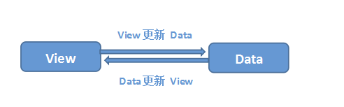
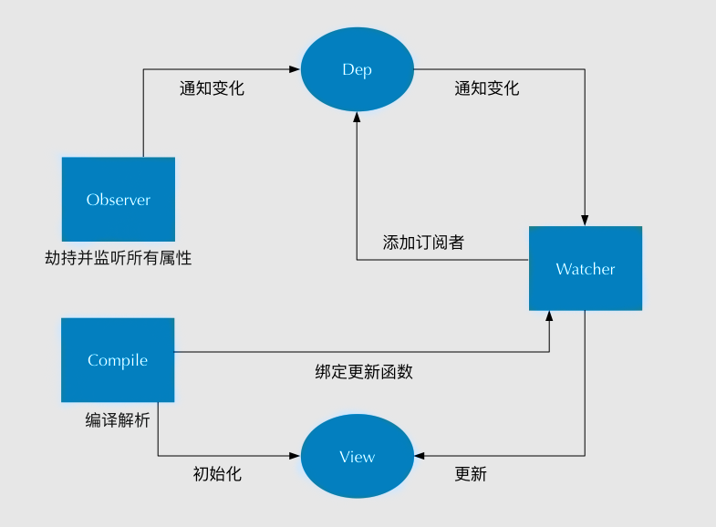

# Vue

[[TOC]]

## Vue响应式原理

Vue双向数据绑定主要是指：视图变化更新数据，数据变化更新视图。如图所示：



即：

* 输入框内容变化时，Data中数据同时变化
* Data中数据变化时，文本节点内容同时变化

其中View更新Data可能通过事件监听的方式实现，所以Vue的双向数据绑定工作主要是如何根据Data变化更新View。

Vue 主要通过以下 4 个步骤来实现数据双向绑定的：

1. 实现一个监听器 Observer：对数据对象进行深度遍历，利用 Object.defineProperty() 给属性都加上 getter 和 setter，来监听数据变化。

2. 实现一个解析器 Compile：解析 Vue 模板指令，将模板中的变量都替换成数据，然后初始化渲染页面视图，并将每个指令对应的节点绑定更新函数，添加监听数据的订阅者，一旦数据有变动，收到通知，调用更新函数进行数据更新。

3. 实现一个订阅者 Watcher：Watcher 订阅者是 Observer 和 Compile 之间通信的桥梁 ，主要的任务是订阅 Observer 中的属性值变化的消息，当收到属性值变化的消息时，触发解析器 Compile 中对应的更新函数。

4. 实现一个订阅器 Dep：订阅器采用 发布-订阅 设计模式，用来收集订阅者 Watcher，对监听器 Observer 和订阅者 Watcher 进行统一管理。




## Object.defineProperty()有什么缺点？Vue2中是如何hack的？

## 深入响应式原理

### 派发更新

`dep.notify()`会遍历Watcher触发`watcher.update()`,`update()`添加到更新队列中，在下一次`$nextTick`时执行更新操作。

### nextTick

数据的变化到 DOM 的重新渲染是一个异步过程，发生在下一个 tick。这就是我们平时在开发的过程中，比如从服务端接口去获取数据的时候，数据做了修改，如果我们的某些方法去依赖了数据修改后的 DOM 变化，我们就必须在 `nextTick` 后执行。比如下面的伪代码：

```js
getData(res).then(()=>{
  this.xxx = res.data
  this.$nextTick(() => {
    // 这里我们可以获取变化后的 DOM
  })
})
```

Vue.js 提供了 2 种调用 `nextTick` 的方式，一种是全局 API `Vue.nextTick`，一种是实例上的方法 `vm.$nextTick`，无论我们使用哪一种，最后都是调用 `next-tick.js` 中实现的 `nextTick` 方法。

